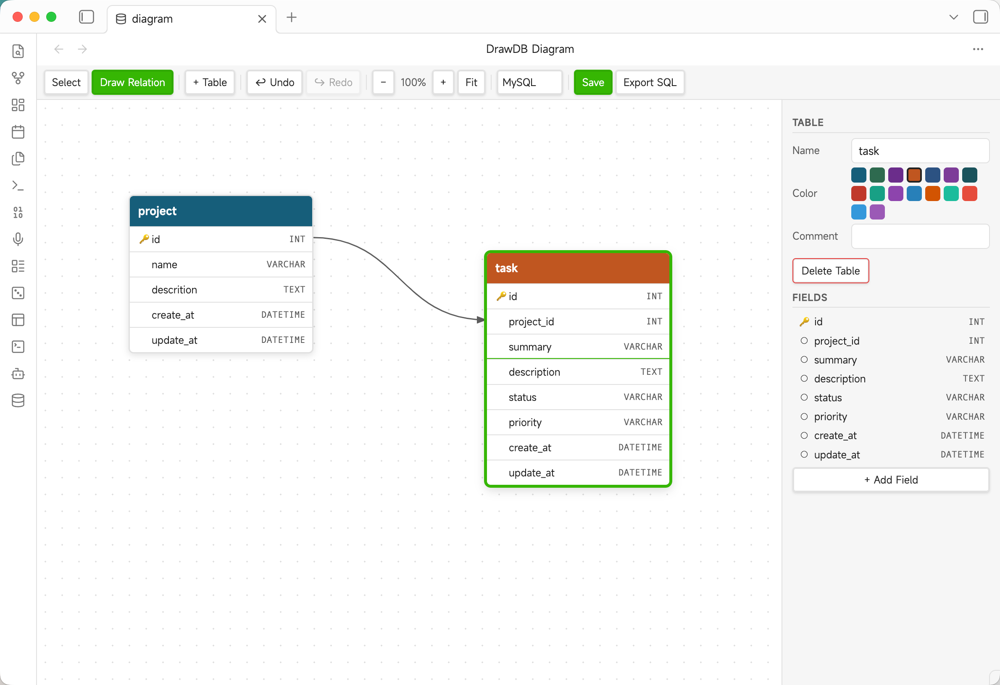

# Obsidian DrawDB

A visual database diagram editor (ER diagrams) for [Obsidian](https://obsidian.md), powered by [drawdb](https://github.com/drawdb-io/drawdb).

Create, edit, and export relational database schemas directly inside your vault using `.drawdb` files — fully compatible with the drawdb JSON format.



---

## Features

- **Visual ER diagram editor** — drag-and-drop tables on an infinite canvas
- **Table & field management** — add/edit/delete tables and fields with types, constraints, and comments
- **Relationships** — draw foreign key relationships between fields with configurable cardinality and ON UPDATE/DELETE behavior
- **Multi-database support** — MySQL, PostgreSQL, SQLite, MSSQL, MariaDB field types
- **Export SQL** — generate `CREATE TABLE` + `ALTER TABLE FOREIGN KEY` statements
- **Undo / Redo** — full history with Ctrl+Z / Ctrl+Shift+Z
- **Pan & zoom** — mouse wheel zoom, middle-button / Space+drag pan, Fit-to-screen
- **drawdb compatible** — `.drawdb` files use the same JSON format as [drawdb.io](https://drawdb.io), so diagrams can be opened and edited in either tool
- **Light & dark theme** — adapts to your Obsidian theme automatically

---

## Screenshot


---

## Usage

### Create a new diagram

- Click the **database icon** in the left ribbon, or
- Run the command **DrawDB: New diagram** from the command palette

A new `diagram.drawdb` file is created in your vault root and opened in the editor.

### Open an existing `.drawdb` file

Click any `.drawdb` file in the file explorer — it opens automatically in the DrawDB editor.

### Editing

| Action | How |
|--------|-----|
| Add a table | Click **+ Table** in the toolbar, or double-click an empty area on the canvas |
| Move a table | Drag the colored header |
| Select a table | Click the header; properties appear in the right panel |
| Edit a field | Click a field row in the right panel to expand its properties |
| Add a field | Click **+ Add Field** in the right panel |
| Delete a table | Select it, then click **Delete Table** in the right panel, or press `Delete` |
| Draw a relationship | Switch to **Draw Relation** mode, click a source field, then click a target field |
| Delete a relationship | Click the line on the canvas to select it, then click **Delete Relationship**, or press `Delete` |
| Pan the canvas | Hold `Space` and drag, or use the middle mouse button |
| Zoom | Scroll the mouse wheel (zooms toward cursor) |
| Fit all tables | Click **Fit** in the toolbar |
| Save | Click **Save** or press `Ctrl+S` (`Cmd+S` on Mac) |
| Undo / Redo | `Ctrl+Z` / `Ctrl+Shift+Z` |
| Export SQL | Click **Export SQL** — downloads `schema.sql` |

---

## Installation

### Manual install (development / testing)

1. Build the plugin:
   ```bash
   npm install
   npm run build
   ```
2. Copy `main.js`, `manifest.json`, and `styles.css` to:
   ```
   <YourVault>/.obsidian/plugins/obsidian-drawdb/
   ```
3. In Obsidian: **Settings → Community plugins → Reload plugins**, then enable **DrawDB**.

### Community plugin store

Coming soon — once submitted to the [Obsidian community plugin list](https://github.com/obsidianmd/obsidian-releases).

---

## File format

`.drawdb` files are plain JSON and fully compatible with the [drawdb.io](https://drawdb.io) web app. Example:

```json
{
  "database": "MySQL",
  "tables": [
    {
      "id": 1,
      "name": "users",
      "x": 80,
      "y": 60,
      "color": "#175e7a",
      "comment": "",
      "fields": [
        {
          "id": 2,
          "name": "id",
          "type": "INT",
          "primary": true,
          "unique": true,
          "notnull": true,
          "autoincrement": true,
          "default": "",
          "size": "",
          "comment": "",
          "check": "",
          "values": []
        }
      ],
      "indices": []
    }
  ],
  "references": [],
  "notes": [],
  "areas": []
}
```

---

## Settings

**Settings → DrawDB**

| Setting | Description |
|---------|-------------|
| Default database type | Database type assigned to newly created diagrams (MySQL, PostgreSQL, SQLite, MSSQL, MariaDB) |

---

## Development

```bash
# Install dependencies
npm install

# Watch mode (auto-recompile on save)
npm run dev

# Production build
npm run build

# Lint
npm run lint
```

Requirements: Node.js 18+, npm.

---

## License

[MIT](LICENSE)

---

## Acknowledgements

- [drawdb-io/drawdb](https://github.com/drawdb-io/drawdb) — the original open-source ER diagram editor this plugin is based on
- [obsidianmd/obsidian-sample-plugin](https://github.com/obsidianmd/obsidian-sample-plugin) — plugin template
